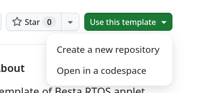
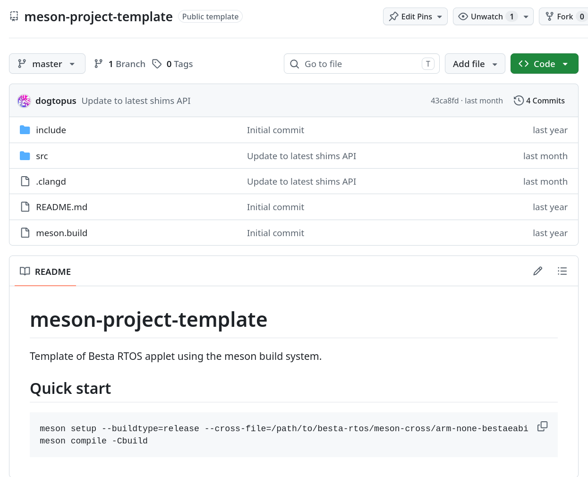

# Getting started

## Setting up the toolchain

Currently Muteki only supports its own GCC flavor, the `arm-none-bestaeabi-gcc`. It is however also possible to use the Embedded Visual C++ toolchain to develop Besta RTOS homebrew, and we may support it to some extent in the future. Regardless, using Muteki's customized GCC is still recommended over Embedded Visual C++, as the former supports more up-to-date language features like C11/C17, and it is possible to have future updates that add or improve features (e.g. C++ exceptions), that are otherwise difficult or impossible to implement on Embedded Visual C++.

### GCC (`arm-none-bestaeabi`)

TODO

### Embedded Visual C++

TODO

## Creating your first project

### Using Meson with GCC

Muteki provides first tier support for the [Meson build system](https://mesonbuild.com/). Simply use or clone the [template repository](https://github.com/Project-Muteki/meson-project-template), as well as clone the [cross files](https://github.com/Project-Muteki/meson-cross) repository to get started.



Once you created your own repository, it may look something like this:



The `src` folder will contains all the source code of your project and any applet metadata, and the `include` folder will contain any common headers. The `meson.build` file in the root directory defines how various build tools should be found, and the `meson.build` under the `src` folder defines how the applet should be built.

To build the project, simply do it the standard way (plus the cross file):

```sh
cd your-project-root
# Assuming meson-cross was cloned besides your-project-root
meson setup --buildtype=release --cross-file=../meson-cross/arm-none-bestaeabi.ini builddir
meson compile -Cbuild
```

### Change the branding and applet version

To change the name and/or version of the applet, one needs to change a few files.

First, open `meson.build` and change `meson-applet-template` to a name of your choice. This name is for the Meson project. Similar for Meson project version number.

Then you need to open the `src/meson.build` file and change any occurrences of `Applet` to a name of your choice. This changes the target name and the output file name.

Finally, open the `src/romspec.toml` file, and change all `title`, `short-title` to names of your choice. It is also safe to delete entries for languages that you do not wish to support. You can also change the `category`, `copyright` or `version` to your liking. Beware that `copyright` and `version` may not show up anywhere on Arm ports of Besta RTOS.

After you made all the changes, rebuild the project.
