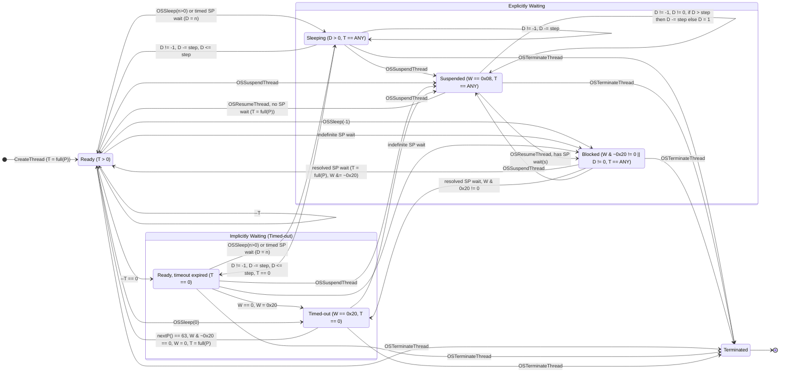

# The Besta RTOS kernel

## Introduction

The Besta RTOS kernel is based on a modified [uC/OS-II](https://github.com/weston-embedded/uC-OS2) kernel. uC/OS-II was a popular commercial, source-available RTOS originally developed by Micriµm, before its current rights holder, Weston Embedded, open-sourced it under Apache-2.0 license. Besta RTOS shares parts of the scheduler, thread model and synchronization primitives with uC/OS-II, however the naming of the threading and synchronization primitive API is partially borrowed from Win32, rather than inherited from uC/OS-II alone.

## Scheduler and thread model

The Besta RTOS scheduler algorithm is partially inherited from uC/OS-II. Both scheduler use an [8x8 ready table](https://micrium.atlassian.net/wiki/spaces/osiidoc/pages/163854/Kernel+Structure#Ready-List) to mark active threads and to do @f$ \Theta(1) @f$ lookup of the next highest priority thread. As such, most of the members in the @ref bxc_thread_t structure have a counterpart in uC/OS-II's [Task Control Block](https://micrium.atlassian.net/wiki/spaces/osiidoc/pages/163854/Kernel+Structure#Task-Control-Blocks-(OS_TCBs)) (TCB). For example, @ref bxc_thread_t.slot has the exact same purpose as `OSTCBPrio`. The exact behavior of the scheduler of the two kernels however are very different, as Besta RTOS implements a weighted round-robin scheduling scheme using the uC/OS-II machinery, instead of the simpler "highest priority thread always wins unless it yields voluntarily" scheme used by uC/OS-II. This means higher priority threads get more CPU time but all threads eventually yield at a point, whether voluntarily or by force, so lower priority threads can still run even when no voluntary OSSleep() call was made by the higher priority threads.

### Scheduler timing

Fundamentally the scheduler keeps track of time using **scheduler ticks** (with period denoted as @f$T@f$). This is typically driven by an interrupt channel backed by a hardware timer on the device, and the period is possibly defined per-device. On top of the tick interrupt period, Besta RTOS also establishes the concept of **time units** (denoted as @f$U@f$). This is what the applets would normally see when it comes to scheduler timing (through for example OSSleep() or the timeout parameter passed to waitables), and 1 @f$U@f$ roughly equals to 1 millisecond in real time. In practice, one @f$U@f$ can represent time less than one @f$T@f$. The scheduler thus keeps track of an integer @f$U_{unit}@f$ of how many time units equal to one tick interrupt period (i.e. @f$U_{unit} = \lfloor \frac{T}{U} \rfloor@f$). If @ref bxc_thread_t.sleep_counter is less than or equal to a single scheduler tick (@f$U_{unit}@f$), the scheduler makes it available to be selected for the next execution.

### The idle task

During scheduler initialization, a idle thread is automatically created using OSCreateThread() with an assigned priority value of 63. The scheduler also makes special handling.

### Thread timeout mechanism

As mentioned in the intro, when picking the next thread to execute, the original uC/OS-II scheduler always chooses the highest priority active thread. On its intended platforms (i.e. small, self-contained, possibly microcontroller-based systems) this makes sense, as thread interactions are typically clearly defined on these systems to prevent possible starvation of the lower priority threads. On Besta RTOS however, the starvation could be a problem as Besta RTOS's use-case leans more towards a multi-program and multi-media operating system focused on user interaction, rather than uC/OS-II's default tightly-integrated controller use-case, meaning a single bug in an external program could halt critical system tasks and/or causing sluggish UI response or audio stutter. Likely as a step to mitigate this problem, Besta RTOS introduced a timeout mechanism to its scheduler. When a thread is created, a timeout value (@ref bxc_thread_t.timeout, in number of scheduler ticks) that is inverse-proportional to its priority value is assigned to the thread. Let @f$ P_{thread} @f$ be the priority value of the thread, the formula that is used to determine the initial timeout value is @f$ T_{timeout} = \lfloor \frac{64 - P_{thread}}{16} \rfloor + 1 @f$. Behavior-wise, the timeout is 5 for priority 0, 4 for priority 1-16, 3 for 17-32, etc. The idle thread is excluded from this calculation, as it does not need a timeout by design.

The scheduler decrements the timeout value of the current active thread (that is **not** already timed out/yielded) on every scheduler tick. When the value reaches 0, the thread will be put into the "timed out" state (adding @ref BXC_WAIT_ON_YIELD to @ref bxc_thread_t.wait_reason), and the next active highest priority thread will then be picked to run. This process will repeat itself until no thread is active other than the idle thread. When that happens either during a scheduler tick or an explicit reschedule request, the scheduler enumerates the thread linked list and takes all threads that have the wait reason of @ref BXC_WAIT_ON_YIELD out of the timed out/yielded state@ref note_1 "1", and the execution resumes at the highest priority thread again after the context switch that follows the tick/reschedule.

Sleeping may also change the behavior of the timeout value. When OSSleep() is called with a **non-zero time unit**, the thread goes into sleep without resetting its timeout value, so it can then go back to work after a sleep and until the timeout runs out, totalling approximately the same amount of work time as if it did not sleep at all. On the other hand, when OSSleep() is called with a **zero time unit**, the thread immediately yields by writing 0 to its timeout value and setting the @ref BXC_WAIT_ON_YIELD wait reason, resulting in a wait until all other threads have timed out. To put it simply, `while (1) OSSleep(0);` should load the scheduler less than `while (1) OSSleep(1);` due to less CPU time being allocated to the thread calling the former, while the former also has **higher** latency between each OSSleep() call than the latter.

### Synchronization primitive wait timeout

Certain synchronization primitives (semaphore and event) can either wait indefinitely or up to a certain amount of time units. This reuses the same @ref bxc_thread_t.sleep_counter member and logic used by OSSleep() to keep track of time. In case of a timeout without resolution, the thread awaiting the synchronization primitive will be waken up with the result code of @ref BXC_WAIT_RESULT_TIMEOUT. If the @ref bxc_thread_t.sleep_counter is set to `-1`, it tells the scheduler that the thread has been blocked by an indefinite wait on a synchronization primitive, and the scheduler will leave it alone until a resolution has been made and the value being reset back to `0`.

> [!NOTE]
> This blocking behavior can apparently also be triggered by using OSSleep(). This basically results in a dead thread that cannot be waken up automatically other than by manually setting the counter back to `0` from another thread (with e.g. OSWakeUpThread()).

Other synchronization that does not time out (critical section) blocks the thread indefinitely until they are resolved by another thread. They also write `-1` to @ref bxc_thread_t.sleep_counter for the reason mentioned above.

### Putting it all together

The above behaviors, including the ones inherited from uC/OS-II and Besta RTOS-specific behavior, results in a state transition algorithm roughly illustrated below:

Definitions:

- `T`: the timeout value (@ref bxc_thread_t.timeout)
- `W`: the wait reason (@ref bxc_thread_t.wait_reason)
- `D`: the sleep counter (@ref bxc_thread_t.sleep_counter)
- `P`: Current thread priority/slot number (@ref bxc_thread_t.slot)
- `full(P)`: The function used to initialize the timeout value
- `nextP()`: Priority of the next thread to be run
- `SP`: Synchronization primitives
- `step`: @f$ U_{unit} @f$

## Footnotes

@anchor note_1 1. To be exact, in case of a scheduler tick, the scheduler actually takes out all the threads that are otherwise not waiting on anything other than @ref BXC_WAIT_ON_YIELD, meaning it does not matter whether or not that bit is actually set, at least in this specific case.
