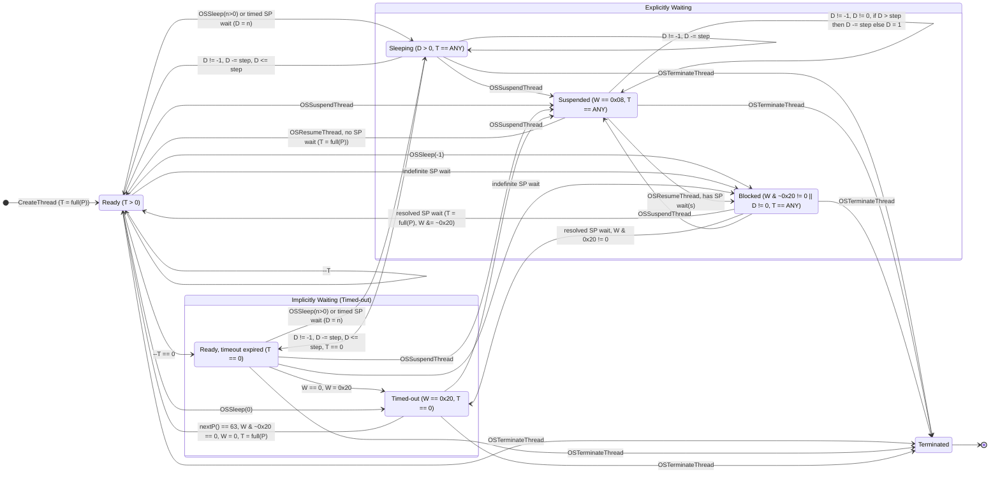

# The Besta RTOS kernel

## Introduction

The Besta RTOS kernel is based on a modified [uC/OS-II](https://github.com/weston-embedded/uC-OS2) kernel. uC/OS-II was a popular commercial, source-available RTOS originally developed by Micriµm, before its current rights holder, Weston Embedded, open-sourced it under Apache-2.0 license. Besta RTOS shares parts of the scheduler, thread model and synchronization primitives with uC/OS-II, however the naming of the threading and synchronization primitive API is partially borrowed from Win32, rather than inherited from uC/OS-II alone.

This page will mainly focus on highlighting the modifications Besta made to the uC/OS-II kernel, but will also document how Besta RTOS kernel behaves in certain scenarios. For understanding general uC/OS-II behavior, one should also read the [uC/OS-II documentation](https://micrium.atlassian.net/wiki/spaces/osiidoc/overview?homepageId=163892) alongside this page, specifically the parts that describe scheduler and synchronization primitive behavior.

## Scheduler and thread model

The Besta RTOS scheduler algorithm and its thread model are partially inherited from uC/OS-II. Both scheduler use an [8x8 ready table](https://micrium.atlassian.net/wiki/spaces/osiidoc/pages/163854/Kernel+Structure#Ready-List) to mark active threads and to do @f$ \Theta(1) @f$ lookup of the next highest priority thread. As such, most of the members in the @ref bxc_thread_t structure have a counterpart in uC/OS-II's [Task Control Block](https://micrium.atlassian.net/wiki/spaces/osiidoc/pages/163854/Kernel+Structure#Task-Control-Blocks-(OS_TCBs)) (TCB). For example, @ref bxc_thread_t.slot has the exact same purpose as `OSTCBPrio`. The exact behavior of the scheduler of the two kernels however are very different, as Besta RTOS implements a weighted round-robin scheduling scheme on top of existing uC/OS-II machinery, instead of the simpler "highest priority thread always wins unless it yields voluntarily" scheme used by uC/OS-II. This means higher priority Besta RTOS threads get more CPU time but all threads eventually yield at a later point, whether voluntarily or by force, so lower priority threads can still run even when no voluntary OSSleep() call was made by the higher priority threads.

### Scheduler timing

Fundamentally the scheduler keeps track of time using **scheduler ticks** (with period denoted as @f$T@f$). This is typically driven by an interrupt channel backed by a hardware timer on the device, and the period is possibly defined per-device. On top of the tick interrupt period, Besta RTOS also establishes the concept of **time units** (denoted as @f$U@f$). This is what the applets would normally see when it comes to scheduler timing (through for example OSSleep() or the timeout parameter passed to waitables), and 1 @f$U@f$ roughly equals to 1 millisecond in real time. In practice, one @f$U@f$ can represent time less than one @f$T@f$. The scheduler thus keeps track of an integer @f$U_{unit}@f$ of how many time units equal to one tick interrupt period (i.e. @f$U_{unit} = \lfloor \frac{T}{U} \rfloor@f$). If @ref bxc_thread_t.sleep_counter is less than or equal to a single scheduler tick (@f$U_{unit}@f$), the scheduler makes it available to be selected for the next execution.

### The idle task

During the scheduler initialization, an idle thread that does practically nothing is automatically created using OSCreateThread() with an assigned priority value of 63. The scheduler also makes special handling for the situation when the only thread that is ready to be executed is the idle thread. Specifically the scheduler will wake up the threads that are "timed-out", which we will elaborate later.

### Thread timeout mechanism

As mentioned in the intro, when picking the next thread to execute, the original uC/OS-II scheduler always chooses the highest priority active thread. On its intended platforms (i.e. small, self-contained, possibly microcontroller-based systems) this makes sense, as thread interactions are typically clearly defined on these systems to prevent possible starvation of the lower priority threads. On Besta RTOS however, the starvation could be a problem as Besta RTOS's use-case leans more towards a multi-program and multi-media operating system focused on user interaction, rather than uC/OS-II's default tightly-integrated controller use-case, meaning a single bug in an external program could halt critical system tasks and/or causing sluggish UI response or audio stutter. Likely as a step to mitigate this problem, and [possibly also as a de-facto industry practice](https://web.archive.org/web/20090916005236/https://www.eeworld.com.cn/qrs/2009/0204/article_1084.html) back then, Besta RTOS introduced a timeout mechanism to its scheduler. When a thread is created, a timeout value (@ref bxc_thread_t.timeout, in number of scheduler ticks) that is inverse-proportional to its priority value is assigned to the thread. Let @f$ P_{thread} @f$ be the priority value of the thread, the formula that is used to determine the initial timeout value is @f$ T_{timeout} = \lfloor \frac{64 - P_{thread}}{16} \rfloor + 1 @f$. Behavior-wise, the initial timeout is @f$ 5T @f$ for priority 0, @f$ 4T @f$ for priority 1-16, @f$ 3T @f$ for 17-32, etc. The idle thread is excluded from this calculation, as it does not need a timeout by design.

The scheduler decrements the timeout value of the current active thread (that is **not** already timed out/yielded) on every scheduler tick. When the value reaches 0, the thread will be put into the "timed out" state (adding @ref BXC_WAIT_ON_YIELD to @ref bxc_thread_t.wait_reason), and the next active highest priority thread will then be picked to run. This process will repeat itself until no thread is active other than the idle thread. When that happens either during a scheduler tick or an explicit reschedule request, the scheduler enumerates the thread linked list and takes all threads that have the wait reason of @ref BXC_WAIT_ON_YIELD out of the timed out/yielded state@ref note_1 "<sup>1</sup>", and the execution resumes at the highest priority thread again after the context switch that follows the tick/reschedule.

Sleeping may also change the behavior of the timeout value. When OSSleep() is called with a **non-zero time unit**, the thread goes into sleep without resetting its timeout value, so it can then go back to work after a sleep and until the timeout runs out, totalling approximately the same amount of work time as if it did not sleep at all. On the other hand, when OSSleep() is called with a **zero time unit**, the thread immediately yields by writing 0 to its timeout value and setting the @ref BXC_WAIT_ON_YIELD wait reason, resulting in a wait until all other threads have timed out. To put it simply, `while (1) OSSleep(0);` should load the scheduler less than `while (1) OSSleep(1);` due to less CPU time being allocated to the thread calling the former, while the former also has **higher** latency between each OSSleep() call than the latter.

### Synchronization primitive wait

Certain synchronization primitives (semaphore and event) can either wait indefinitely or up to a certain amount of time units. This reuses the same @ref bxc_thread_t.sleep_counter member and logic used by OSSleep() to keep track of time. In case of a timeout without resolution, the thread awaiting the synchronization primitive will be waken up with the result code of @ref BXC_WAIT_RESULT_TIMEOUT. If the @ref bxc_thread_t.sleep_counter is set to `-1`, it tells the scheduler that the thread has been blocked by an indefinite wait on a synchronization primitive, and the scheduler will leave it alone until a resolution has been made and the value being reset back to `0`.

> [!NOTE]
> This blocking behavior can apparently also be triggered by using OSSleep(). This basically results in a dead thread that cannot be waken up automatically other than by manually setting the counter back to `0` from another thread (with e.g. OSWakeUpThread()).

Other synchronization primitives that do not time out (critical section and queue) blocks the thread indefinitely until they are resolved by another thread. They also write `-1` to @ref bxc_thread_t.sleep_counter for the reason mentioned above.

### Putting it all together

The above behaviors, including the ones inherited from uC/OS-II and Besta RTOS-specific behavior, results in a state transition algorithm roughly illustrated below:



Definitions:

- `T`: the timeout value (@ref bxc_thread_t.timeout)
- `W`: the wait reason (@ref bxc_thread_t.wait_reason)
- `D`: the sleep counter (@ref bxc_thread_t.sleep_counter)
- `P`: Current thread priority/slot number (@ref bxc_thread_t.slot)
- `full(P)`: The function used to initialize the timeout value
- `nextP()`: Priority of the next thread to be run
- `SP`: Synchronization primitives
- `step`: @f$ U_{unit} @f$

## Synchronization primitives

Besta RTOS provides four types of synchronization primitives: critical section, semaphore, event and queue.

### General data structure

Like their uC/OS-II counterpart Event Control Block (ECB), all synchronization primitives follow a common data layout, documented as @ref bxc_waitable_desc_u. The simplified version looks like this:

```c
typedef struct {
    int magic;
    intptr_t user_data0;
    short user_data1;
    bxc_waitable_t wait_state;
    char user_data2;
} bxc_synch_primitive_t;
```

The scheduler uses `magic` to differentiate among the synchronization primitives. Different types of synchronization primitives can also store their own data in `user_data*` members. `wait_state` holds the same data as the uC/OS-II's `OSEventGrp` and `OSEventTbl` members of the [ECB](https://micrium.atlassian.net/wiki/spaces/osiidoc/pages/163893/Event+Control+Blocks#Use-of-Event-Control-Blocks) combined as one, and is also semantically the same as `OSEventGrp` + `OSEventTbl`.

### Critical section

Critical sections provide a way to synchronize between two threads in a mutually exclusive manner (i.e. one thread can ensure a block of code that accesses specific resources is executed without being interleaved by code from another thread that attempts to access the same resources). They are also known as [locks](https://en.wikipedia.org/wiki/Lock_(computer_science)) or mutexes on other operating systems.

The Besta RTOS implementation of critical section shares similar idea with the [uC/OS-II mutex](https://micrium.atlassian.net/wiki/spaces/osiidoc/pages/163896/Mutual+Exclusion+Semaphores): they both update a flag that is local to the synchronization primitive and only touch the thread when the thread needs to wait for them. The implementations however differ. The Besta RTOS implementation supports recursive locking, and therefore it maintains a counter instead of a binary flag. Whenever a thread is trying to recursively acquire the critical section, the counter gets incremented by one. The reverse happens when the same thread tries to release it. When a different thread tries to get a hold on it however, that thread will be immediately told to wait, until the first thread releases it. If multiple threads are trying to wait on the same critical section, the highest priority thread wins.

Critical sections only support indefinite wait and has no concept of timeout, and the acquire/release operation against a critical section always eventually succeeds. They also do not register with the thread when that thread owns it, unlike other Besta RTOS synchronization primitives, or even its uC/OS-II counterpart.

### Semaphore

A [semaphore](https://en.wikipedia.org/wiki/Semaphore_(programming)) provides a way to count number of acquisitions synchronously, and blocks other acquisition attempts until a thread that already acquired it releases it.

Aside from the ECB format and timeout handling behavior, Besta RTOS's semaphore implementation is effectively the same as [the semaphore implementation from uC/OS-II](https://micrium.atlassian.net/wiki/spaces/osiidoc/pages/163886/Semaphore+Management): A counter that is initialized to a initial count value, and that counter gets decremented by one every time a thread acquires the semaphore through OSWaitForSemaphore(), until it reaches zero, then the thread gets blocked until some other thread releases the semaphore using OSReleaseSemaphore(). If multiple threads are trying to acquire the same semaphore with the counter value of one, the highest priority thread wins.

Semaphore supports both definite and indefinite wait. In definite wait mode, the wait behaves similar to OSSleep(), except obviously that it can be interrupted by the event of some threads releasing the semaphore. If the timeout parameter is set to `-1` for OSWaitForSemaphore(), it activates the indefinite wait behavior.

### Event

An event signals its subscriber threads that something has happened. Unlike its name suggests, Besta RTOS's event implementation is closer related to uC/OS-II's [message mailbox](https://micrium.atlassian.net/wiki/spaces/osiidoc/pages/163874/Message+Mailbox+Management), minus the ability to pass arbitrary messages@ref note_2 "<sup>2</sup>": Instead of checking whether a message is available, Besta's event implementation simply checks for a numerical flag and either resolves when the flag is 1, or waits when the flag is 0.

Like semaphores, events also support both definite and indefinite wait.

### Queue

A queue passes user messages between threads in a synchronous manner.

The Besta RTOS implementation of the queue resembles the uC/OS-II [message queue](https://micrium.atlassian.net/wiki/spaces/osiidoc/pages/163860/Message+Queue+Management): Both use a ring buffer with a waitable wrapper to implement the synchronization primitive. The implementations however are not exactly the same. The Besta RTOS implementation passes 16-byte data buffers as messages rather than pointers to data like its uC/OS-II counterpart. Various operations are also named similarly to uC/OS-II message queue operations, but do totally different things: OSGetMsgQue() is a variant of `OSQPend()` with only the indefinite wait option; OSPeekMsgQue() behaves like `OSQAccept()`, which is not a peek operation, but rather an asynchronous pop operation; and OSSendMsgQue() and OSPostMsgQue() behave like `OSQPost()`, but the former immediately reschedules, while the latter defers the scheduling to the scheduler tick. There is also no counterpart to `OSQPostFront()`, meaning the queue is First-In-First-Out-only. Due to how the internal ring buffer is implemented (same ring head and tail pointer is treated as a signal for an empty queue), the `size` parameter passed to OSCreateMsgQue() must also be 1 unit larger than the intended maximum queue capacity.

As mentioned before, despite that the original uC/OS-II message queue has support for both definite and indefinite wait, the Besta RTOS queue only supports indefinite wait. The waiting thread's @ref bxc_thread_t.sleep_counter value is hardcoded to be set to `-1` when waiting for a queue.

## Interrupt handling


## Footnotes

@anchor note_1 1. To be exact, in case of a scheduler tick, the scheduler actually takes out all the threads that are otherwise not waiting on anything other than @ref BXC_WAIT_ON_YIELD, meaning it does not matter whether or not that bit is actually set, at least in this specific case.

@anchor note_2 2. A similarly named synchronization primitive in uC/OS-II called an [event flag group](https://micrium.atlassian.net/wiki/spaces/osiidoc/pages/163897/Event+Flag+Management) is both substantially more complex and less similar to a Besta RTOS event. The wait state bit (@ref BXC_WAIT_ON_EVENT) of Besta RTOS event also shares the same numeric value as the wait state bit of uC/OS-II mailbox (`OS_STAT_MBOX`, both are `0x02`). Therefore it is less plausible that the event flag group was the origin of Besta RTOS events, instead mailbox seems to be a more convincing candidate.
